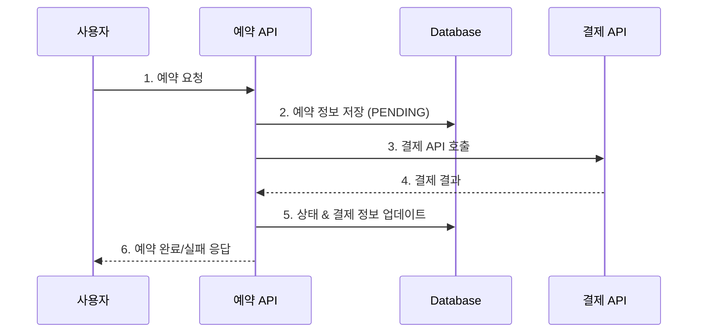
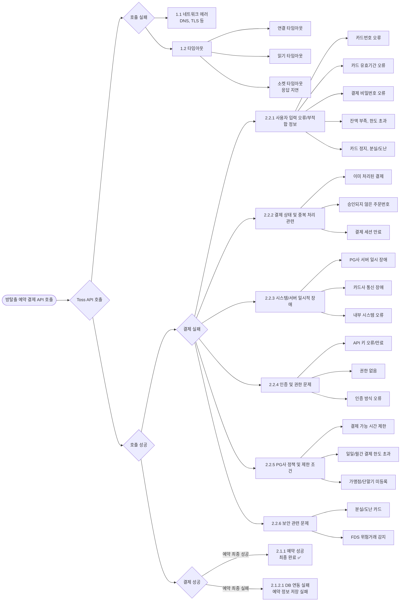
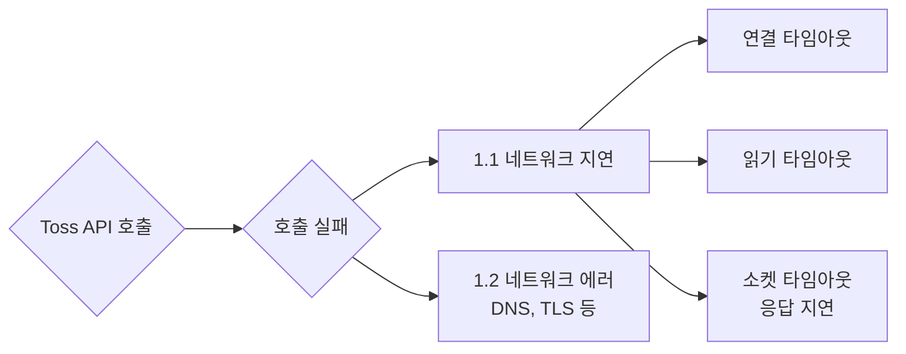

- 전체 시리즈 목차

    ```java
    ## 1편: "결제 연동 실패 대응 전략"
    
    ├── 1. 결제 연동에서 발생하는 장애 유형 개요
    ├── 2. 네트워크/타임아웃 오류 처리
    ├── 3. 기본 재시도 전략 (ExponentialBackoff 등)
    ├── 4. 커넥션 풀 관리와 최적화
    └── 5. 모니터링과 알림 설정
    
    ## 2편: "서킷 브레이커와 장애 차단 전략" (현재 문서)
    
    ├── 1. 서킷 브레이커 패턴 소개 (3가지 상태)
    ├── 2. 장애 전파 차단의 필요성
    ├── 3. 예외 분류의 핵심 원칙
    │   └── "재시도 가능 vs 불가능" 구분 기준
    ├── 4. PaymentErrorType 설계 (5가지 타입), 토스페이먼츠 40여개 에러코드 분석
    ├── 5. resilience4j 설정과 예외 매핑
    ├── 6. PG 노출 차단 전략 (웹훅 방식)
    └── 7. 슬라이딩 윈도우 설정 최적화
    
    ## 3편: "커넥션 풀로 성능 개선하기"
    
    ├── 1. 커넥션 풀링
    ├── 2. 커넥션 풀링 커스텀 설정하기
    │   ├── 2.1 
    
    ## 4편: "결제 성공 후 데이터 정합성 보장"
    
    ├── 1. 결제 성공 후 발생 가능한 문제들
    ├── 2. 트랜잭션 처리 전략 비교
    │   ├── 2.1 동일 트랜잭션 유지 전략
    │   ├── 2.2 보상 트랜잭션 전략  
    │   └── 2.3 비동기 정합성 보장 전략
    ├── 3. 각 전략의 장단점과 선택 기준
    ├── 4. 실제 구현 코드와 예외 처리
    ├── 5. 데이터 복구와 수동 정합성 체크
    └── 6. 결제-예약 상태 불일치 해결 방안`
    ```


방탈출 예약 시스템에서 사용자는 원하는 날짜와 시간을 선택한 후, 예약 가능한 경우에만 결제를 진행합니다. 결제는 금융 거래이므로 자체 서비스에서 직접 처리하기 어렵기 때문에, 외부 **PG사(Payment Gateway) API 연동**을 통해 처리해야 합니다.

이 글에서는 토스 페이먼츠의 [결제 승인 API](https://www.google.com/search?q=https://docs.tosspayments.com/reference/error-codes%23%EA%B2%B0%EC%A0%9C-%EC%8A%B9%EC%9D%B8)를 기준으로 외부 API 연동 시 고려해야 할 사항과 안정적인 구현 방법을 중점적으로 다룹니다.

### 전체 시스템 흐름

방탈출 예약 시스템의 결제 과정은 다음과 같은 흐름으로 진행됩니다.



예약과 결제가 하나의 요청에서 처리된다면, 특정 단계에서 실패하였을 때 데이터 일관성을 보장해야 한다. 해당 요청에서 실패가 발생할 수 있는 상황은 다음과 같다.

### **실패 가능 지점**

1. 예약 가능 여부를 확인할 때
2. 예약 정보를 저장할 때
3. 결제 연동에 실패하였거나 또는 결제 실패 응답을 받았을 때
4. 결제 성공 정보를 저장할 때

각 단계별로 발생할 수 있는 시나리오와 처리 방안에 대해 알아보자.

---

# 결제 연동에서 발생하는 장애 유형

외부 서비스 연동은 대부분의 서버 개발에서 필수적이지만, 우리 서비스의 안정성에 직접적인 영향을 줄 수 있습니다. 따라서 외부 서비스의 품질과 상황을 분석하고, 연동 과정에서 발생할 수 있는 문제로 인한 영향을 최소화해야 합니다.

결제 연동에서 발생할 수 있는 장애를 크게 세 가지 시나리오로 분류할 수 있습니다.

### 연동 자체의 실패

- **네트워크 오류**: DNS 실패, TLS 인증서 오류, 방화벽 차단
- **타임아웃**: Connection Timeout, Read Timeout, Socket Timeout
- **서버 다운**: PG사 서버 장애, 점검 상황

### **외부 시스템과 연동 성공, 결제 실패 응답**

사용자 오류, 정책 제한, 일시적 오류 등

- **사용자 오류**: 카드 정보 오류, 잔액 부족, 한도 초과
- **정책 제한**: 시간대 제한, 일일 한도 초과, 가맹점 제한
- **일시적 오류**: 카드사 통신 장애, 내부 시스템 오류

### **결제 성공, 후속 처리 실패**

- **데이터베이스 저장 실패**: 예약 정보 저장 실패
- **트랜잭션 롤백**: 결제는 성공했지만 예약 저장 실패
- **정합성 문제**: 결제와 예약 상태 불일치

각 케이스 별로 적절한 처리 방안을 살펴보겠습니다.



---

## 연동 실패

먼저 API 호출 자체에 실패하여 대상 서버와 연동하지 못한 경우로, 네트워크 문제에 의해 발생한다.



### **1. 네트워크 지연**

네트워크 지연은 크게 세 가지 유형으로 분류할 수 있다.

- **Connection Timeout**: TCP 커넥션 수립 시간 지연
- **Read Timeout**: 서버 응답 수신 시간 초과
- **Socket Timeout**: 패킷 간 시간 간격 지연


네트워크 지연이 발생했을 때는 적정 타임아웃 값을 지정하여 불필요한 지연 시간을 최소화할 수 있다.

### **2. 네트워크 에러**

네트워크 에러 문제는 DNS 조회 실패, TLS 인증서 오류, 방화벽 차단, 프록시 설정 이슈 등으로 인해 발생한다.
이러한 경우는 대부분 시스템 레벨의 문제이므로 애플리케이션에서 할 수 있는 조치는 제한적이다.

자바에서 제공하는 예외 클래스로 보면, 호스트까지의 라우트를 찾을 수 없는 경우 등 다양한 예외들이 있다.

- UnknownHostException, ConnectException, ConnectionClosedException, SSLException, NoRouteToHostException

### **처리 전, 네트워크 문제를 사용자 관점에서 생각해보자**

그렇다면, 위 경우에서 발생하는 에러는 사용자가 알아야 할 에러일까? 또 네트워크 지연은 타임아웃 값만 지정하면 끝일까? 네트워크 통신 과정에서 간헐적으로 실패인 경우, 재시도를 통해 사용자가 인지하기 전에 연동 실패를 성공으로 바꿀 수 있다.

이 점을 고려하여 네트워크 상황에 따른 처리를 진행해보자
