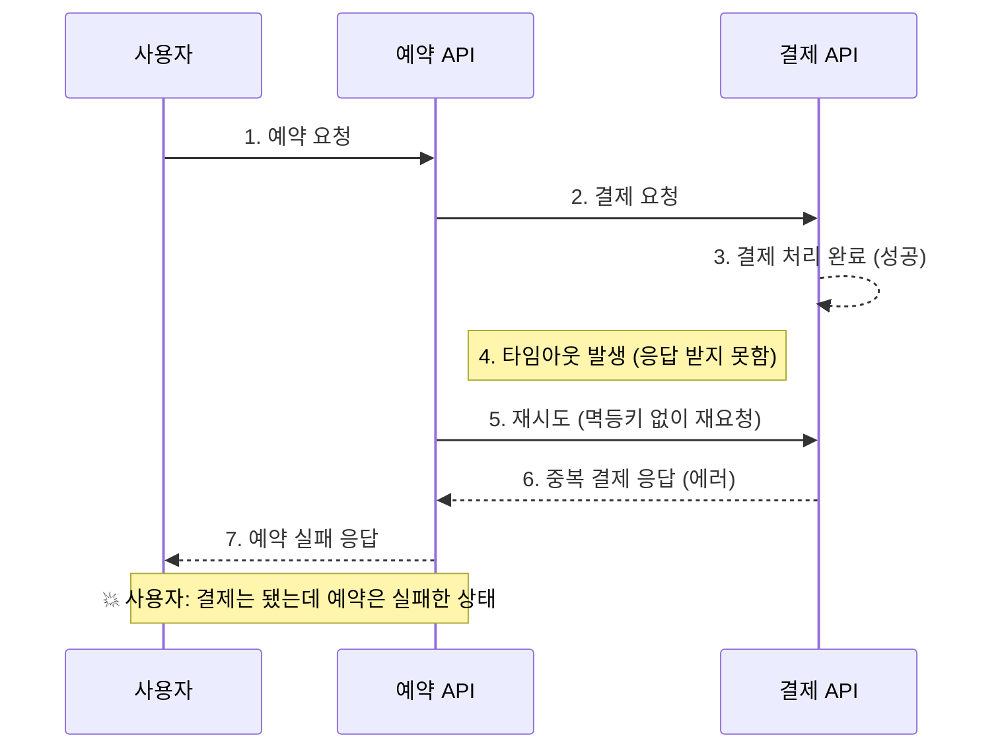
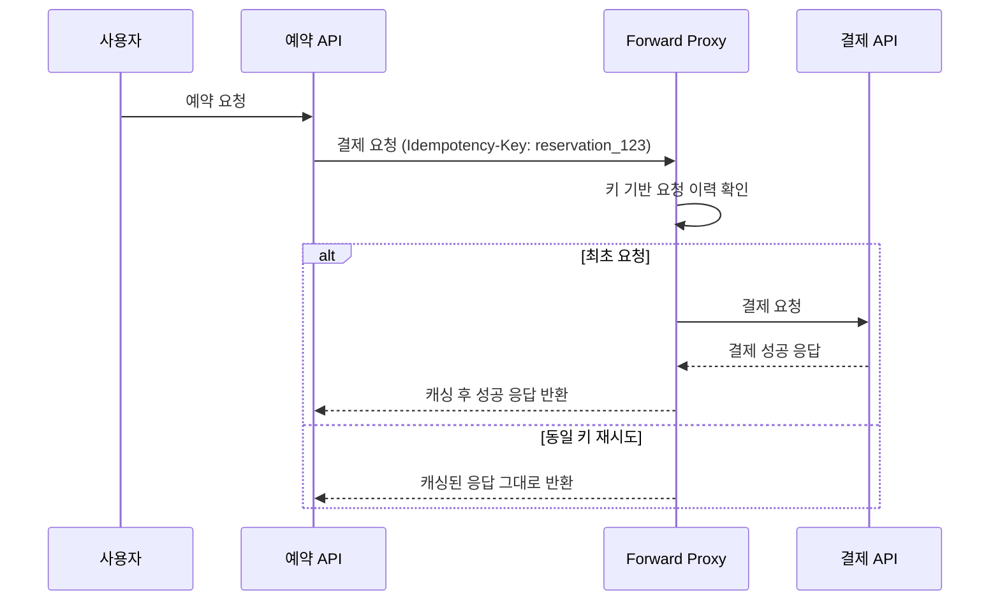

- 전체 시리즈 목차

    ```java
    ## 1편: "결제 연동 실패 대응 전략"
    
    ├── 1. 결제 연동에서 발생하는 장애 유형 개요
    ├── 2. 네트워크/타임아웃 오류 처리
    ├── 3. 기본 재시도 전략 (ExponentialBackoff 등)
    ├── 4. 커넥션 풀 관리와 최적화
    └── 5. 모니터링과 알림 설정
    
    ## 2편: "서킷 브레이커와 장애 차단 전략" (현재 문서)
    
    ├── 1. 서킷 브레이커 패턴 소개 (3가지 상태)
    ├── 2. 장애 전파 차단의 필요성
    ├── 3. 예외 분류의 핵심 원칙
    │   └── "재시도 가능 vs 불가능" 구분 기준
    ├── 4. PaymentErrorType 설계 (5가지 타입), 토스페이먼츠 40여개 에러코드 분석
    ├── 5. resilience4j 설정과 예외 매핑
    ├── 6. PG 노출 차단 전략 (웹훅 방식)
    └── 7. 슬라이딩 윈도우 설정 최적화
    
    ## 3편: "커넥션 풀로 성능 개선하기"
    
    ├── 1. 커넥션 풀링
    ├── 2. 커넥션 풀링 커스텀 설정하기
    │   ├── 2.1 
    
    ## 4편: "결제 성공 후 데이터 정합성 보장"
    
    ├── 1. 결제 성공 후 발생 가능한 문제들
    ├── 2. 트랜잭션 처리 전략 비교
    │   ├── 2.1 동일 트랜잭션 유지 전략
    │   ├── 2.2 보상 트랜잭션 전략  
    │   └── 2.3 비동기 정합성 보장 전략
    ├── 3. 각 전략의 장단점과 선택 기준
    ├── 4. 실제 구현 코드와 예외 처리
    ├── 5. 데이터 복구와 수동 정합성 체크
    └── 6. 결제-예약 상태 불일치 해결 방안`
    ```


# 연동 실패 처리하기

## 1. Connection Timeout 처리하기

### TCP 연결 시간에 영향을 주는 시스템/네트워크 레벨 요소

Connection Timeout은 TCP handshake 과정이 실패하여 커넥션이 수립되지 못할 경우 발생한다.

이때, 타임아웃 값이 너무 짧으면 일시적인 네트워크 지연에도 실패가 많아지고 너무 길면 다운된 시스템에 불필요하게 오래 대기하게 되기 때문에 적절한 값 설정이 필요하다.

Linux OS에서는 TCP 통신에서 처음 보낸 패킷이 응답을 못 받았을 때,

다시 말해, syn 패킷을 보내고 ack-syn 패킷을 받을 때 대기가 길어질 때 sync 패킷을 재전송하기까지 기다리는 시간을 지정하고 이 이상이 지난 경우 다시 패킷을 전송한다.

이 시간을 InitRTO라고 하는데 Linux에서는 1초이기 때문에, 이 값을 참고하여 설정할 수 있다. OS 레벨에서 1초가 걸린다면 애플리케이션 레벨에서는 그 이상의 값을 설정하는 것이 적절할 수 있다.

하지만 이는 요청 즉시 연동 서버와의 커넥션을 수립할 때의 경우이다.

만약 Connection Pool을 사용하여 연동한다면 **미리 커넥션을 생성하여 풀에 유지**하므로, 대부분의 **요청에서는 커넥션 수립 과정이 발생하지** 않는다.

### Connection Pooling 여부에 따른 Connection 수립 시간

Connection Pooling을 사용할 경우에 `Connection Timeout`은 다음 상황에서만 영향을 줍니다.

- 풀에 사용 가능한 커넥션이 **없고**, 새로운 커넥션을 생성해야 할 때
- 커넥션이 idle 상태에서 끊어졌고, 재수립이 필요할 때

이러한 상황은 상대적으로 적기 때문에, Connection Timeout은 조금 더 짧게 설정해도 무방합니다.

```java
    // 클라이언트 커넥션 풀에 대해 전체 풀링 동작을 설정, 기본 커넥션 구성을 적용
    private PoolingHttpClientConnectionManager connectionManager() {
        return PoolingHttpClientConnectionManagerBuilder.create()
                .setMaxConnTotal(200)
                .setMaxConnPerRoute(50)
                .setDefaultConnectionConfig(connectionConfig())
                .build();
    }

    private ConnectionConfig connectionConfig() {
        return ConnectionConfig.custom()
                .setConnectTimeout(Timeout.ofSeconds(1))
                .build();
    }
```

우리 서버에서는 응답 시간의 최소화를 위해 커넥션 풀을 사용하여 연동하려고 했기 때문에 커넥션 타임아웃의 값을 1초로 지정해주었다.

### 재시도로 실패 응답을 성공으로 바꾸기

Connection Timeout의 경우 연결 자체가 수립되지 않아 서버 측에서 요청을 처리하지 않았음으로 재시도를 통해 연결에 성공할 가능성이 높다.

앞서 설정한 PoolingHttpClientConnectionManager은 retry 전략을 지정하는 설정을 제공한다.

```java
    private PoolingHttpClientConnectionManager connectionManager() {
        return PoolingHttpClientConnectionManagerBuilder.create()
                .setMaxConnTotal(200)
                .setMaxConnPerRoute(50)
                .setDefaultConnectionConfig(connectionConfig())
                // 재시도 전략 설정
                .setRetryStrategy(DefaultHttpRequestRetryStrategy.INSTANCE)
                .build();
    }
```

다만, 제공하는 기본 전략인 DefaultHttpRequestRetryStrategy가 재시도를 해도 되는 요청인지 판단하는데, 이 조건이 멱등성을 지닌 http method 여야만 재시도 처리한다.

연동 api인 결제는 post 메서드를 사용하기 때문에 커스텀이 필요한데 이는 뒤의 read timeout 처리에서 이어나가겠다.

```java

package org.apache.hc.client5.http.impl;

@Contract(threading = ThreadingBehavior.STATELESS)
public class DefaultHttpRequestRetryStrategy implements HttpRequestRetryStrategy {

    @Override
    public boolean retryRequest(
            final HttpRequest request,
            final IOException exception,
            final int execCount,
            final HttpContext context) {
            
        // Retry if the request is considered idempotent
        return handleAsIdempotent(request);
    }
    
    protected boolean handleAsIdempotent(final HttpRequest request) {
		    // POST인 경우 false 반환됨
        return Method.isIdempotent(request.getMethod());
    }
}

```

---

## 2. Read Timeout 처리하기, 멱등성?

### 영향을 주는 것, 연동 서버의 처리 시간

Read Timeout은 연동 서버의 처리 시간을 고려해야 한다. 만약 연동 서버가 평균적으로 10초 걸리는 수행 시간을 보인다고 할때, 타임아웃 값이 2초라면 서버가 정상적으로 요청을 처리하고 있음에도 실패 처리가 되는 셈이다.

특히 결제 같은 기능을 연동할 때, 너무 짧지 않게 설정하는 것이 중요하다. 만약 너무 짧게 처리하여 예외가 반환되었는데, 연동 서버는 결제 성공 처리가 된 상태일 수도 있기 때문이다. ~~사용자 입장에서, 방탈출 예약 요청에 실패했는데 결제는 됐다면 빅이슈이다.~~

토스 페이먼츠는 공식 문서에서 30초로 권장했기 했기 때문에 해당 값을 사용하여 설정하였다.

### Read Timeout, 결제 요청인데 재시도를 해도 될까?

Read Timeout, Socket Timeout 역시 재시도를 통해 성공으로 응답을 변경시킬 수 있다. 하지만 요청의 중복이 발생할 수도 있기 때문에, 멱등성을 고려해야 한다.

만약 단순 조회 요청이라면 여러번 재시도를 해도 멱등(Idempotency)한 응답을 제공하기 때문에 무방하다.


하지만 연동 서비스가 결제를 처리하고 있는 중에 리드 타임아웃 시간을 초과하여 우리 서버에서 연결을 끊었고, 그 상태에서 재시도를 하게 될 경우 중복 결제가 될 가능성이 있다. 최악의 경우 결제가 되었는데 예약은 실패했을 수도 있다.



### 롤백되어 결제만 성공한 시나리오 예방하기

이 중복을 막는 것에 대해서는 다음의 2가지를 고려했다.

1. [멱등키 헤더](https://docs.tosspayments.com/reference/using-api/authorization#%EB%A9%B1%EB%93%B1%ED%82%A4-%ED%97%A4%EB%8D%94)를 통해 연동 서버 측에서 중복 요청을 무시하도록 한다.
  1. 가장 간편하고 안전하지만 연동 서버에서 멱등키 헤더를 제공해야 적용 가능하다.
2. 리드 타임아웃 발생 시 재시도 전에 PG사 결제 상태 조회 API를 통해 기존 결제 결과를 확인한다.
  1. 일부 PG는 결제 상태 조회 API를 제한적으로 제공하거나, 실시간 정확성이 떨어질 수 있다.
3. 중복 결제된 요청에 대해 취소 요청을 보낸다.
  1. 취소 요청 자체가 누락되거나 실패할 수 있어, 그에 대한 보정 로직이 필요하다.

토스는 멱등키 헤더를 제공해주고 있기 때문에 리드 타임아웃 발생 시에도 가장 간편하면서도 안전한 처리라고 생각하여 1번안을 도입하였다.

### 멱등하지 않는 요청을 멱등키 헤더를 사용하여 재시도, 일관성 보장하기

그렇다면 Read Timeout 도 멱등키를 사용해서 재시도로 실패 응답을 성공으로 바꾸어 보자.

토스 API는 멱등키 헤더를 제공하는데, 동일 키를 가지고 요청을 처리할 경우 최초의 요청만 처리하고 그 이후로는 성공 응답만 반환하고 실제 처리를 하지 않는다.


헤더에 함께 보낼 멱등키는 결제 요청이 아닌 예약 요청에 대해 1대1 매핑되어야 한다. 결제는 여러번 재시도 될 수 있기 때문에 만약 결제마다 멱등키를 재발급 받는다면 하나마나하기 때문이다.

따라서 다음과 같이, 예약 ID 기반으로 멱등키 생성할 수 있다.

```java
@Component
public class PaymentService {
    
    public PaymentResponse processPayment(ReservationRequest request) {
        String idempotencyKey = generateIdempotencyKey(request.getReservationId());
        
        return paymentClient.callPaymentApi(
            request.getPaymentKey(),
            request.getAmount(),
            idempotencyKey
        );
    }
    
    private String generateIdempotencyKey(Long reservationId) {
        // 예약 ID 기반으로 멱등키 생성
        return "reservation_" + reservationId;
    }
}

@Component
public class TossPaymentClient extends PaymentClient {

    private final RestClient restClient;

    @Override
    public PaymentInfoFromClient confirm(ConfirmPaymentRequest confirmPaymentRequest, String idempotencyKey) {
        return restClient.post()
                .uri("/confirm")
                .body(confirmPaymentRequest)
                // 요청에 멱등키 헤더 설정
                .header(IDEMPOTENCY_KEY_HEADER, idempotencyKey) 
                .retrieve()
                .toEntity(PaymentInfoFromClient.class)
                .getBody();
    }

```

앞서 언급했듯이 스프링은 client 커넥션 풀에 대해 설정을 커스텀할 수 있는데, 네트워크 연동 실패 예외에 대해 기본 재시도 전략인 DefaultHttpRequestRetryStrategy를 제공한다.

하지만 제공되는 DefaultHttpRequestRetryStrategy는 http method가 멱등성을 가진 method인 경우에만 재시도를 허용하기 때문에, 우리의 결제 요청은 POST 이므로 적용되지 않는다. 따라서 커스텀이 필요하다.

따라서 기존 구현 부분에서 멱등한지 판단하는 기준을 멱등키 헤더를 포함하는 요청인지로 수정한 새로운 전략을 만들어 등록해주었다.

```java
public class IdempotencyKeyRetryStrategy implements HttpRequestRetryStrategy {

    protected static final String IDEMPOTENCY_KEY_HEADER = "Idempotency-Key";

    @Override
    public boolean retryRequest(
            final HttpRequest request,
            final IOException exception,
            final int execCount,
            final HttpContext context
    ) {
				// 기존 구현 - 요청이 멱등한지 판단 후 최종적으로 재시도 가능 판별
        return handleAsIdempotent(request);
    }
		
		// POST 요청이지만 Idempotency-Key를 포함한 경우는 재시도 허용
    protected boolean handleAsIdempotent(final HttpRequest request) {
        return Method.isIdempotent(request.getMethod()) 
		        || request.containsHeader(IDEMPOTENCY_KEY_HEADER);
    }
}

```

## +) PG사에 의존하지 않도록 포워드 프록시로 멱등성 보장하기

기준으로 삼은 토스 페이먼츠는 멱등성 헤더를 제공하지만, 이를 제공하지 않는 PG사를 연동할 때 어떻게 처리하면 좋을까?

내가 생각한 방법은 연동 서버와 우리 서버 간의 *포워드 프록시를* 두는 것이다.


https://hudi.blog/forward-proxy-reverse-proxy/

포워드 프록시는 요청을 보내는 클라이언트 측 바로 뒤에 놓여있는데,

클라이언트가 대상 서버에 직접 접근하는 게 아니라 포워드 프록시가 요청을 받고 인터넷에 연결하여 서버 응답을 클라이언트에게 전달한다. 보통 캐싱이나 보안 등을 목적으로 사용한다.

### 포워드 프록시에서 멱등성 보장하기

프록시는 다음과 같은 방식으로 멱등성을 제공할 수 있다.

1. **요청 캐싱**
  - 클라이언트 → 프록시로 들어오는 요청에 대해 `Idempotency-Key`를 우리 서버에서 생성하여 함께 전달한다.
  - 프록시는 해당 키를 기반으로 요청/응답을 저장한다.
  - 동일 키로 들어오는 요청이 감지되면, PG사에 새 요청을 전달하지 않고 **기존 응답을 재전달**한다.
2. **중복 요청 차단**
  - 프록시 레벨에서 `Idempotency-Key`를 기반으로 요청이 이미 처리된 상태인지 검사한다.
  - 결제가 이미 성공했다면 PG사에 요청을 재전송하지 않고 바로 성공 응답을 반환한다.
  - 만약 최초 요청이 실패로 끝났다면 동일 키로 재시도 시 PG사에 다시 전송한다.
3. **결제 상태 확인 연계**
  - PG사가 상태 조회 API를 제공한다면, 프록시는 멱등키에 매핑된 결제 상태가 애매한 경우 자동으로 상태 조회 API를 호출하여 캐싱된 결과를 보정할 수 있다.
  - 이렇게 하면 네트워크 단절이나 타임아웃 시에도 일관성 있는 응답을 줄 수 있다.



- PG사가 멱등키 기능을 지원하지 않아도 자체적으로 멱등성을 구현할 수 있다.
- 여러 PG사 연동 시에도 **통합 멱등 처리 레이어**를 제공할 수 있다.
- 실패 응답 보정(재시도 → 성공 응답 치환)이 가능하다.
