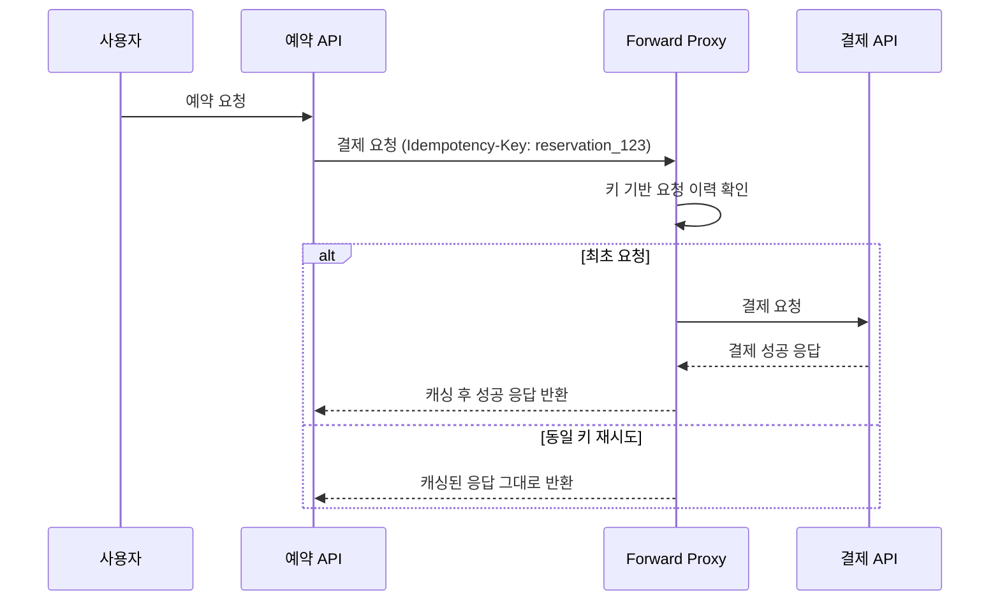

이전 글에서는 네트워크 에러 상황과 재시도 처리 시 멱등성 헤더를 통해 정합성을 보장하는 설계를 구현하였다.

하지만 토스가 아닌 다른 PG 사를 사용할 때, 해당 PG 사가 멱등키 헤더를 제공하지 않는다면 이를 사용할 수 없다. 따라서 PG사에 의존하지 않도록 우리 서비스 측에서 멱등성을 보장하도록 개선해보자.

# PG사에 의존하지 않도록 멱등성 보장하기

## **캐시 서버 vs. 포워드 프록시**

기준으로 삼은 토스 페이먼츠는 멱등성 헤더를 제공하지만, 이를 제공하지 않는 PG사를 연동할 때 어떻게 처리하면 좋을까?

내가 생각한 방법은 연동 서버 요청 전 우리 서버에서 캐시 서버 또는 포워드 프록시 서버를 통해 두는 것이다.

### **포워드 프록시 (Forward Proxy)**

애플리케이션 외부에 별도의 프록시 서버를 구축하는 방식이다.

클라이언트가 대상 서버에 직접 접근하는 게 아니라 포워드 프록시가 요청을 받고 인터넷에 연결하여 서버 응답을 클라이언트에게 전달한다.


즉 모든 외부 요청이 이 서버를 거쳐 가도록 구성하며, 다음과 같은 특징이 있다.

- 별도의 프록시 서버를 애플리케이션 외부에 구축하는 방식
- 캐싱, 보안, 로깅 등 다양한 공통 기능을 애플리케이션과 분리하여 중앙에서 관리 가능
- 별도의 서버를 구축하고 운영해야 하므로 추가적인 비용과 관리 포인트가 발생
- 요청이 애플리케이션 → 포워드 프록시 → PG사 순으로 한 단계를 더 거치게 되므로, 미세한 네트워크 지연이 추가 가능

### **캐시 서버 (Cache Server)**

애플리케이션에 내장되거나 가까운 위치에 데이터를 임시 저장하는 고속 저장소를 활용하는 방식이다.

- In-Memory 캐시(Redis 등)를 사용하면 매우 빠른 속도로 중복 요청을 판단하고 응답 가능
- 별도의 프록시 서버 없이 애플리케이션 레벨에서 직접 사용하므로 구조가 비교적 간단
- 포워드 프록시와 마찬가지로 캐시 서버 자체에 대한 구축 및 운영 비용이 발생

### 최종 선택: Redis를 활용한 캐시 서버 방식

결론적으로 **캐시 서버 방식**을 채택했으며, 저장소로는 **Redis**를 선택했다. 결제 재시도 요청은 **짧은 시간 안에 연속적으로 발생할 확률이 높다**는 특성을 고려할 때, 포워드 프록시의 구조적 이점보다는 **Redis의 압도적인 처리 속도**가 더 중요하다고 판단했다.

Redis를 선택한 구체적인 이유는 다음과 같다.

- In-Memory 기반의 빠른 속도가 특징이므로 재시도 요청을 신속하게 처리 가능
  - 재시도 요청을 신속하게 식별하고 캐시된 응답을 즉시 반환해야 하는 시나리오에 최적
- 원자적 연산을 통한 Race Condition 방지
  - 싱글 쓰레드로 동작하기 때문에 Key에 대한 원자적(Atomic) 연산을 보장한다.
  - 거의 동시에 들어오는 중복 요청에 대해 `SETNX` (SET if Not eXists) 같은 명령어를 사용하면, 단 하나의 요청만 처리되도록 보장하여 Race Condition을 방지 가능
- 영속성 옵션
  - Redis는 인메모리 DB이기 때문에 휘발될 수 있다는 특성을 가지고 있다. 하지만 payment key가 짧은 결제 만료 시간을 가지고 있다는 점에서 긴 시간이 흐른 후에 사용될 가능성이 적다고 판단하였다.
  - 그럼에도 불구하고 예기치 못한 서버 중단 상황에서 예방하기 위해 Redis는 인메모리 DB지만, 스냅샷(RDB)이나 AOF(Append Only File) 같은 영속성 옵션을 제공한다. 따라서 이를 활용하면 예기치 못한 서버 중단 시에도 데이터 유실을 최소화할 수 있다.

즉, 결제 키(Payment Key)는 만료 시간이 비교적 짧아 완전한 영속성보다는 빠른 처리가 중요하지만, 안정성을 더할 수 있기 때문에 Redis를 사용해도 좋을 것이라 판단하였다.

---

## 멱등성 구현 방식

프록시 혹은 캐시 레이어에서는 다음과 같이 멱등성을 보장할 수 있다.

1. **요청 캐싱**
  - 클라이언트에서 들어오는 요청에 대해 `Idempotency-Key`를 우리 서버에서 생성한다.
  - 동일 키 요청이 감지되면 PG사에 새 요청을 전달하지 않고 **기존 응답을 재전달**한다.
2. **중복 요청 차단**
  - 동일 키 요청이 이미 처리 중인지 검사한다.
  - 결제가 이미 성공했다면 PG사에 재전송하지 않고 **즉시 성공 응답** 반환
  - 최초 요청이 실패했으면 동일 키 재시도 시 PG사로 전달



# 레디스와 함께 구현해보기

포워드 프록시에서 멱등성을 보장하려면, 같은 Idempotency-Key로 들어오는 중복 요청을 식별하고 이미 처리된 응답을 재전달해야 한다.

주요 목표는 다음과 같다.

- 동일한 `Idempotency-Key`로 들어온 요청은 PG로 **단 한 번만** 전달한다.
- 최초 요청의 결과(성공/실패/불확실)를 **캐싱**하고, 이후 동일 키 요청에는 **캐시된 응답**을 반환한다.
- 네트워크 단절/타임아웃 등으로 결과가 불확실한 경우, **상태 조회 API**로 보정하거나 **재시도**한다.

## Spring Interceptor와 Redis로 구현하기

재시도 시 빠른 응답과 정합성 보장을 위해 **Redis 캐시 서버**를 활용하여 멱등성을 구현했다.

### 1. Redis Cache 설정

`@Cacheable`을 사용하기 위한 기본 설정으로 TTL(Time To Live)은 결제 키의 유효 시간을 고려해 24시간으로 설정했다.

```java
@Configuration
public class CacheConfig {

    @Bean
    public RedisCacheConfiguration cacheConfiguration() {
        return RedisCacheConfiguration.defaultCacheConfig()
                .entryTtl(Duration.ofHours(24))
                .serializeKeysWith(RedisSerializationContext.SerializationPair.fromSerializer(new StringRedisSerializer()))
                .serializeValuesWith(RedisSerializationContext.SerializationPair.fromSerializer(new GenericJackson2JsonRedisSerializer()));
    }
}
```

### **2. Idempotency Interceptor 구현**

그 후 `Idempotency-Key` 헤더를 기반으로 요청을 가로채어 멱등성 처리하는 Interceptor를 구현해주었다.

동일 키 요청 시 캐시된 응답을 재사용하며 최초 요청만 실제 PG 호출 (`execution.execute`) 후 결과를 반환한다.

```java
@Component
public class IdempotencyInterceptor implements ClientHttpRequestInterceptor {

    private static final String IDEMPOTENCY_KEY_HEADER = "Idempotency-Key";
		// 생략
		
    @Override
    public ClientHttpResponse intercept(HttpRequest request, byte[] body, ClientHttpRequestExecution execution)
            throws IOException {
        String idempotencyKey = request.getHeaders().getFirst(IDEMPOTENCY_KEY_HEADER);
        if (idempotencyKey == null || idempotencyKey.isBlank()) {
            return execution.execute(request, body);
        }
				
				// 캐시 서버에서 조회
        ConfirmPaymentResponseFromClient response = cacheableIdempotencyService.getOrCallPg(idempotencyKey, () -> {
            try {
                ClientHttpResponse resp = execution.execute(request, body);
                byte[] responseBody = resp.getBody().readAllBytes();
                return objectMapper.readValue(responseBody, ConfirmPaymentResponseFromClient.class);
            } catch (IOException e) {
                throw new RuntimeException(e);
            }
        });
        byte[] responseBody = objectMapper.writeValueAsBytes(response);
        return ByteArrayClientHttpResponse.from(responseBody, HttpStatusCode.valueOf(200));
    }
}
```

### **3. Cacheable Service 구현**

선언형 `@Cacheable` 어노테이션을 통해 복잡한 캐시 로직을 매우 간결하게 구현했다.

- 메서드 호출 전, `idempotencyKey`를 키로 캐시를 조회
- 캐시가 있으면 메서드 본문(`pgCall.get()`)을 실행하지 않고 캐시된 값을 즉시 반환
- 캐시가 없으면 메서드 본문을 실행하고, 그 결과를 캐시에 저장한 후 반환

```java
@Service
public class CacheableIdempotencyService {

    @Cacheable(value = "idempotentPayments", key = "#idempotencyKey")
    public ConfirmPaymentResponseFromClient getOrCallPg(String idempotencyKey, Supplier<ConfirmPaymentResponseFromClient> pgCall) {
        return pgCall.get();
    }
}
```

실제 요청을 테스트해보면 다음과 같이 최초 요청이 잘 저장된 것을 확인할 수 있다.


### 테스트 코드

```java
@SpringBootTest
class CacheableIdempotencyServiceTest {

    @Autowired
    private CacheableIdempotencyService cacheableIdempotencyService;

    @Autowired
    private CacheManager cacheManager;

    @DisplayName("같은 idempotencyKey 요청은 pgCall 한번만 실행된다")
    @Test
    void pgCall() {
        // given
        String idempotencyKey = "test-key";
        AtomicInteger counter = new AtomicInteger(0);

        Supplier<ConfirmPaymentResponseFromClient> pgCall = () -> {
            counter.incrementAndGet();
            return new ConfirmPaymentResponseFromClient("payment key", "order id", 100L);
        };

        // when
        ConfirmPaymentResponseFromClient firstCall = cacheableIdempotencyService.getOrCallPg(idempotencyKey, pgCall);
        ConfirmPaymentResponseFromClient secondCall = cacheableIdempotencyService.getOrCallPg(idempotencyKey, pgCall);

        // then
        assertThat(firstCall).isNotNull();
        assertThat(secondCall).isNotNull();
        assertThat(firstCall).isEqualTo(secondCall);

        assertThat(counter.get()).isEqualTo(1);

        // 캐시에 값이 들어갔는지 확인
        Object cached = cacheManager.getCache("idempotentPayments")
                .get(idempotencyKey, ConfirmPaymentResponseFromClient.class);
        assertThat(cached).isEqualTo(firstCall);
    }
}
```


---

## 결론

이번 프로젝트를 통해 특정 PG 기술에서 독립적인 멱등성 보장 계층을 성공적으로 구축했다.

Spring Interceptor와 Redis Cache를 활용하여 기존 코드 변경을 최소화하면서도, 안정적으로 중복 요청을 제어하는 시스템을 구현할 수 있다.

어떤 PG사를 연동하더라도 일관된 정책으로 데이터 정합성을 유지할 수 있으며

추가적으로 클라이언트의 불필요한 재시도가 PG사에 부하를 주지 않으며, 중복 결제 위험을 원천적으로 차단할 수 있는 미세한 효과도 낳을 수 있었다.
