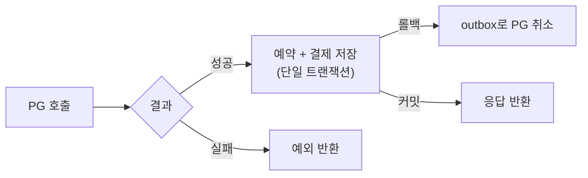
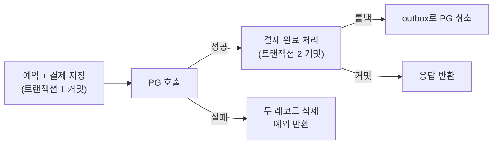
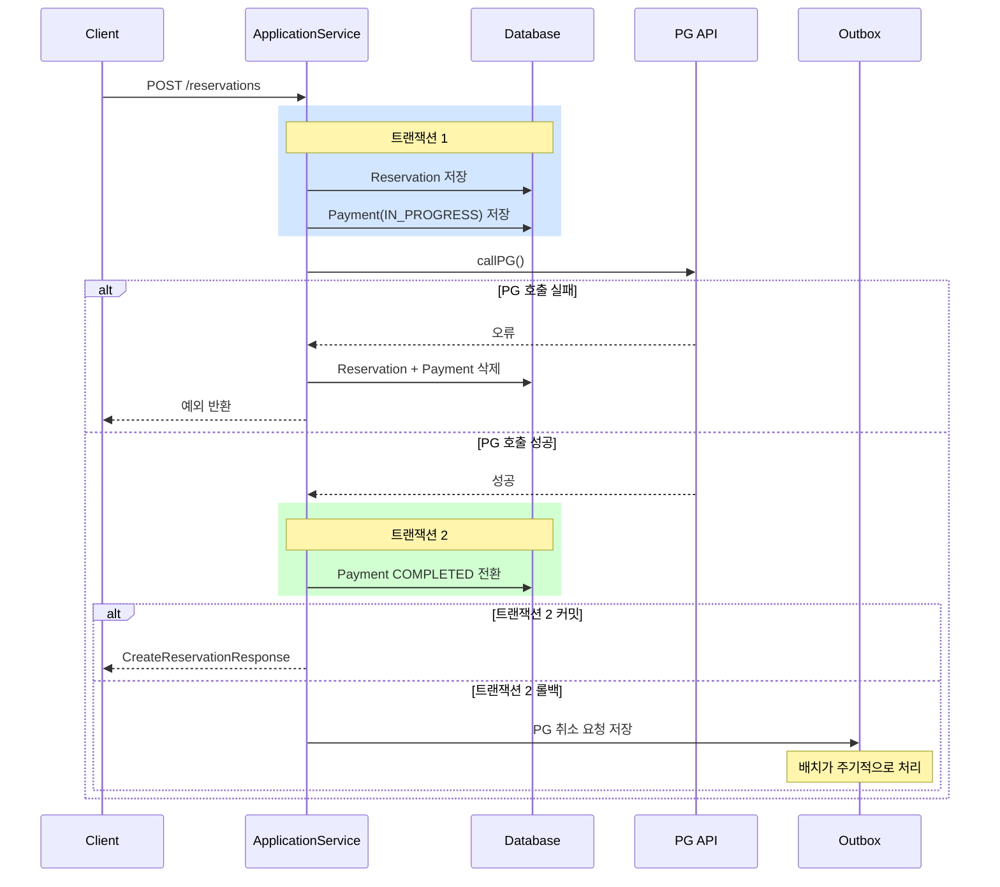

# 외부 PG 결제 API 호출을 트랜잭션에서 분리하기

방탈출 예약 서비스에서 예약과 결제를 처리하는 API를 개발하면서 설계 문제를 발견했다.
예약 생성 요청 하나에 DB 트랜잭션과 외부 PG(Payment Gateway) API 호출이 묶여 있었다.

## 문제: 트랜잭션 안에서 외부 API를 호출하고 있다

```java
@Service
@Transactional
public class ReservationService {

    public CreateReservationResponse createMyReservation(...) {
        Reservation reservation = reservationRepository.save(convertToReservation(request));
        paymentService.createPayment(ConfirmPaymentRequest.from(request), reservation); // 외부 PG 호출
        return CreateReservationResponse.from(reservation);
    }
}

@Service
public class PaymentService {

    @Transactional(propagation = Propagation.REQUIRED) // 같은 트랜잭션에 합류
    public Payment createPayment(...) {
        ConfirmPaymentResponseFromClient response = paymentClient.confirm(request); // 외부 HTTP 호출
        paymentRepository.save(response.toPayment(reservation));
        return payment;
    }
}
```

`PaymentService.createPayment`는 `Propagation.REQUIRED`로 선언되어 있어 `ReservationService`의 트랜잭션에 합류한다.
결국 DB 커넥션을 점유한 채로 외부 PG API 응답을 기다리게 된다.

### 왜 문제인가

PG API 호출은 우리가 제어할 수 없는 외부 시스템이다. 응답 시간이 수백ms에서 수초까지 늘어날 수 있고, 장애 시에는 타임아웃까지 기다려야 한다.

이 상황에서 발생하는 문제는 두 가지다.

**1. DB 커넥션 점유**
트랜잭션이 열려 있는 동안 커넥션 풀에서 커넥션 하나를 잡고 있다. PG 응답을 기다리는 수초 동안 그 커넥션은 다른 요청에 쓰일 수 없다.
동시 예약 요청이 몰리면 커넥션 풀이 고갈되고, DB 작업 자체가 대기 상태에 빠진다.

**2. Tomcat 스레드 지연**
PG API가 느려지면 해당 HTTP 요청을 처리 중인 Tomcat 스레드가 응답을 받을 때까지 블로킹된다.
스레드 풀이 한정되어 있으므로, PG 지연이 길어지면 서버 전체가 응답 불능 상태에 빠질 수 있다.

---

## 해결 방향: 외부 호출을 트랜잭션 밖으로 꺼낸다

이 문제를 해결하는 방식으로 세 가지를 검토했다.

### 옵션 1: Transactional Outbox + 배치

예약을 PENDING 상태로 저장하면서 결제 이벤트를 outbox 테이블에 함께 저장한다 (같은 트랜잭션).
배치 잡이 outbox를 읽어 PG API를 호출하고, 성공 시 예약 상태를 업데이트한다.

- PG 장애가 예약 생성 자체에 영향을 주지 않는다.
- 예약과 결제 정보 유실 가능성이 없다.
- **단점**: 배치 주기만큼 결제 완료가 지연된다. 사용자가 예약 요청 후 즉각적인 성공 여부를 알 수 없다.

### 옵션 2: 비동기 MQ

예약을 PENDING으로 저장하고 결제 이벤트를 MQ에 발행한다.
컨슈머가 이벤트를 받아 PG API를 호출한다.

- 배치보다 처리 속도가 빠르다.
- **단점**: 여전히 비동기 처리라 사용자는 즉각적인 결과를 알 수 없다. MQ 인프라가 추가된다.

### 옵션 3: 트랜잭션 분리, 동기 호출 유지 ✅

PG API 호출을 트랜잭션 밖으로 꺼내되, 사용자에게는 동기적으로 결과를 반환한다.

- 사용자는 요청 즉시 성공/실패를 알 수 있다.
- 트랜잭션 범위에서 외부 호출이 제거된다.
- **단점**: 트랜잭션 분리로 인한 실패 케이스에 대한 별도 처리가 필요하다.

### 옵션 1, 2를 선택하지 않은 이유

방탈출 예약은 결제와 예약 확정이 동시에 이루어져야 하는 구조다.
"결제 중입니다" 상태를 사용자에게 노출하는 방식은 이 도메인에서 자연스럽지 않다.
인프라 복잡도를 올릴 이유 없이 옵션 3으로 원래 문제를 해결할 수 있다.

---

## 설계: DB 선점 후 PG 호출

옵션 3에서 중요한 세부 결정이 하나 남았다. PG 호출과 DB 저장의 순서다.

**방식 A: PG 호출 먼저 → 예약 + 결제 저장**



**방식 B: 선점 저장 먼저 → PG 호출 → 완료 처리 ✅**



방식 A를 선택하면 구조가 단순하다. 하지만 방탈출은 한 슬롯에 한 명만 예약할 수 있다.
인기 슬롯 오픈 시 여러 사용자가 동시에 요청하면, 방식 A에서는 여러 명이 PG 결제까지 진행한 뒤 DB 저장에서 충돌한다.
결제는 됐는데 예약은 실패하는 사용자가 발생하고, PG 취소 처리 케이스가 잦아진다.

방식 B는 저장 시점에 DB unique constraint로 중복을 차단한다.
한 명만 PG 결제까지 도달하고, 나머지는 저장 단계에서 즉시 실패한다.

**방식 B를 선택했다.** PG 취소 케이스를 최소화하는 것이 사용자 경험과 PG 수수료 양쪽에서 유리하다.

---

## 설계: 상태는 예약이 아니라 결제에 있어야 한다

방식 B를 확정한 뒤 또 다른 설계 문제가 남았다. "처리 중"을 나타내는 상태를 어느 엔티티에 둘 것인가.

처음에는 `Reservation`에 `PENDING / CONFIRMED` 상태를 두는 방향을 검토했다.

```java
// 초안
Reservation.status = PENDING | CONFIRMED
```

그런데 이 설계에는 근본적인 문제가 있었다. **완결되지 않은 것은 결제이지 예약이 아니다.** 예약은 특정 슬롯을 특정 사용자가 점유하겠다는 사실을 표현한다. 그 예약이 완결됐는지 아닌지는 결제가 말해야 한다.

### 이중 상태 관리의 문제

`Reservation.status`와 `Payment` 존재 여부가 같은 사실을 서로 다른 방식으로 표현하게 된다.

```
Reservation.status == CONFIRMED → 결제 완료
Payment 존재                    → 결제 완료
```

진실의 출처(source of truth)가 두 곳이 되면, 둘이 다를 때 무엇을 믿어야 하는지 코드가 판단해야 한다. 그 판단 코드가 생기면 동기화 버그가 따라온다.

실제로 admin이 결제 없이 예약을 생성하는 케이스에서 이미 균열이 드러났다. `Reservation`은 항상 `PENDING`으로 생성되는데, admin 예약에는 결제가 없으므로 사실상 완료 상태지만 `status`는 `PENDING`이다. 두 상태가 이미 불일치 중이었다.

### 상태를 Payment로 이동하기

결제의 lifecycle을 `Payment`가 직접 표현하도록 설계를 변경했다.

```java
public enum PaymentStatus {
    IN_PROGRESS, COMPLETED
}
```

tx1에서 `Payment(IN_PROGRESS)`를 예약과 함께 저장하고, PG 호출 성공 후 tx2에서 `COMPLETED`로 전환한다. `Reservation`은 슬롯 점유 사실만 표현하고, 상태 필드를 갖지 않는다.

이 설계의 장점은 두 가지다.

**첫째, 의미가 명확해진다.** "예약이 존재한다"는 슬롯이 점유됐다는 뜻이고, "결제가 `IN_PROGRESS`다"는 PG 호출이 진행 중이라는 뜻이다. 두 사실이 각자의 영역을 말한다.

**둘째, 장애 분석이 쉬워진다.** 앱이 PG 호출 도중 죽었을 때, `Payment(IN_PROGRESS)`가 DB에 남아 있으면 "결제 요청까지는 나간 상태"임을 알 수 있다. 이 레코드를 기반으로 PG에 결제 여부를 확인하고 필요시 취소 처리를 할 수 있다.

---

## 최종 플로우와 실패 케이스 처리



| 실패 시점 | DB 상태 | 처리 방법 |
|---|---|---|
| 트랜잭션 1 실패 | 아무것도 없음 (PG 호출 전) | 예외 반환, 별도 처리 불필요 |
| PG 호출 실패 | Reservation + Payment(IN_PROGRESS) 잔류 | 즉시 두 레코드 삭제 후 예외 반환 |
| 트랜잭션 2 롤백 | Payment가 IN_PROGRESS로 남음 | TransactionSynchronization으로 outbox 저장, 배치 복구 |

---

## 구현

변경되는 파일:

- `PaymentStatus` — `IN_PROGRESS / COMPLETED` enum 추가
- `Payment` — `PaymentStatus` 필드 추가. `complete()` 메서드로 상태 전환.
- `Reservation` — `ReservationStatus` 필드 제거. 슬롯 점유 사실만 표현.
- `PaymentService` — `createInProgressPayment`(tx1용) + `completePayment`(tx2용)으로 분리.
- `ReservationService` — tx1에서 Reservation + Payment(IN_PROGRESS) 함께 생성. cancel 시 두 레코드 모두 삭제.
- `ReservationApplicationService` — 전체 플로우 조율.
- `ReservationController` — `ReservationApplicationService` 호출로 변경.
