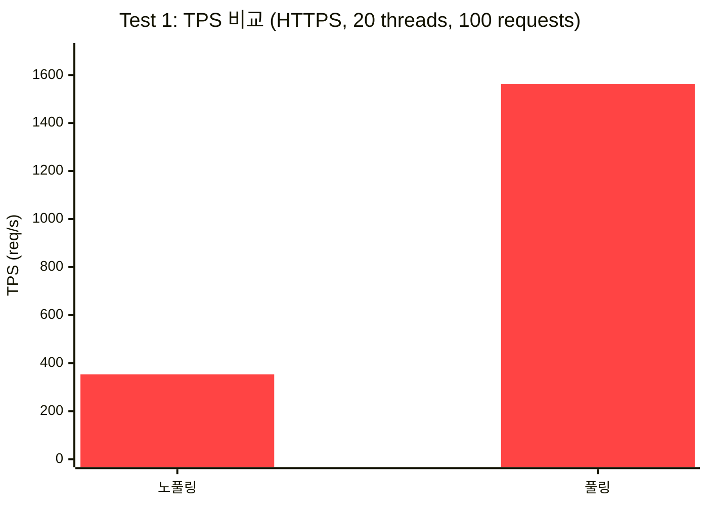
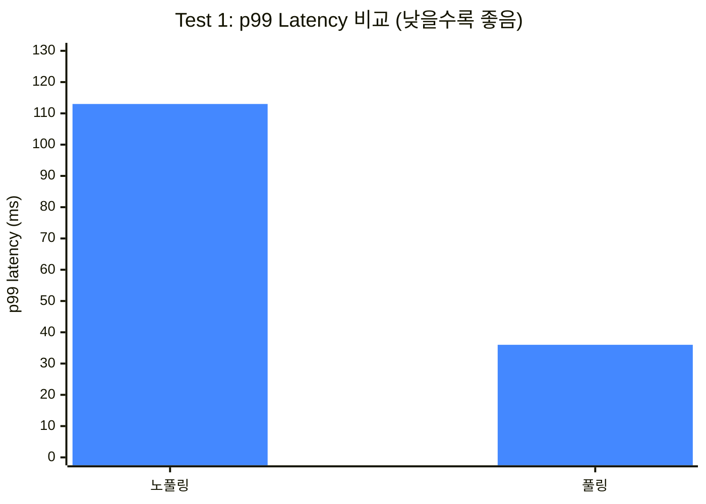
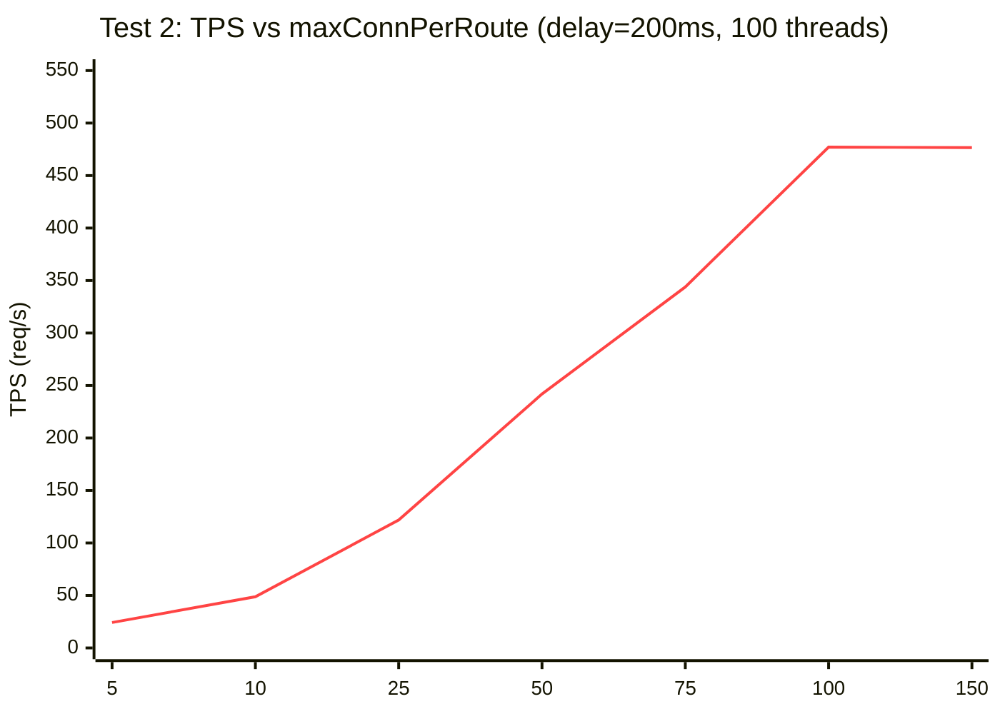
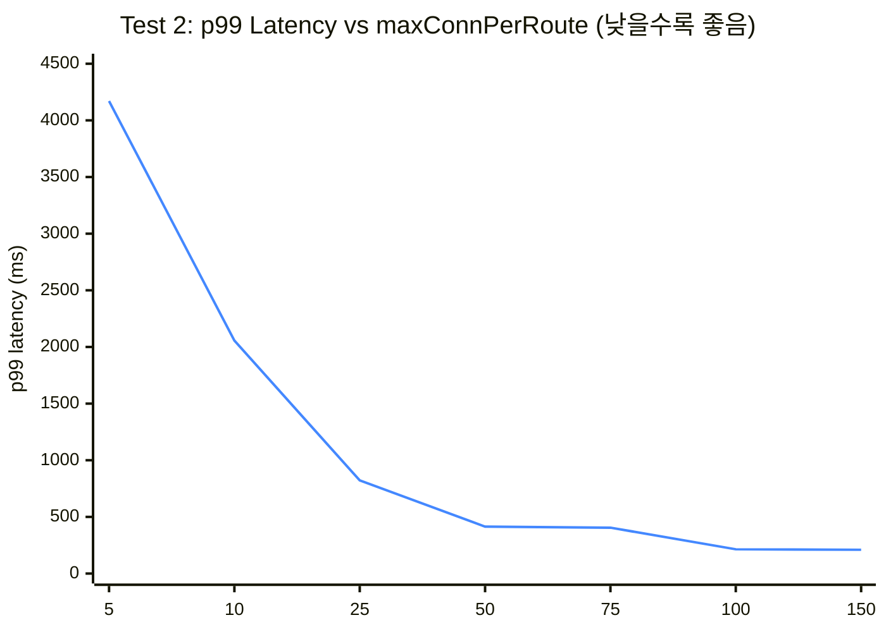

# 커넥션 풀 성능 테스트 레포트

---

## 1. 배경

### 테스트 동기

서버가 외부 API를 호출할 때마다 TCP 연결을 새로 맺으면, 연결 수립에 드는 시간(TCP 3-way handshake + TLS 암호화 협상)이 매 요청에 고정 비용으로 추가된다. 커넥션 풀은 한 번 맺은 연결을 재사용함으로써 이 비용을 제거한다.

`PaymentRestClientConfiguration`은 Toss Payments API를 호출하는 HTTP 클라이언트를 구성한다. 해당 클라이언트에 Apache HttpClient 5 기반의 커넥션 풀을 도입하였으나, 도입 전후의 정량적 비교 데이터가 부재한 상태였다.

풀링이 실제로 성능 개선에 기여하는지, 그리고 현재 설정값이 타당한지에 대한 근거를 수치로 확보하기 위해 본 테스트를 수행하였다.

---

## 2. 테스트 설계

### 측정 목표

| 번호 | 질문 |
|------|------|
| **Test 1** | 커넥션 풀링이 노풀링 대비 얼마나 효용이 있는가? |
| **Test 2** | 상대 서버 응답 평균 200ms 조건에서 최적 `maxConnPerRoute`는 무엇인가? |

두 테스트의 주요 설계 차이는 아래와 같다.

| 항목 | Test 1 (풀링 효용 측정) | Test 2 (최적 설정값 탐색) |
|------|------------------------|--------------------------|
| **변수** | 커넥션 재사용 여부 (노풀링 vs 풀링) | `maxConnPerRoute` 후보값 순차 적용 |
| **서버 지연** | 없음 | 200ms 고정 |
| **프로토콜** | HTTPS (실제 TLS 비용 포함) | HTTP (풀 크기 효과만 격리) |
| **스레드 / 요청 수** | 20 / 100 | 100 / 500 |
| **측정 목적** | 풀링 도입의 정량적 근거 확보 | `maxConnPerRoute` 최적값 도출 |

### 설정값 분류 및 측정 대상 선정

`PaymentRestClientConfiguration`의 커넥션 풀에는 다수의 설정값이 존재한다. 이를 처리량 영향 여부로 분류하면 다음과 같다.

**처리량에 영향을 주는 설정**

| 설정 | 의미 | 처리량 영향 |
|------|------|------------|
| `maxConnPerRoute` | 단일 호스트에 동시에 열 수 있는 최대 커넥션 수. 동시 요청이 이 수를 초과하면 스레드가 대기한다. | **HIGH** |
| `connectionRequestTimeout` | 풀 고갈 시 커넥션을 기다리는 최대 시간. 짧으면 빠른 실패(에러율 증가), 길면 큐 적체(전체 지연 증가). | **HIGH** |
| `connectTimeout` | TCP + TLS 연결 수립 제한 시간. 부하 시 외부 서버가 느리면 초과 → 실패율 증가. | **MEDIUM** |

**처리량과 무관한 설정 (안정성 / 신뢰성)**

| 설정 | 의미 |
|------|------|
| `PoolReusePolicy.LIFO` | 가장 최근에 반환된 커넥션 우선 사용. TLS 세션 재사용 가능성을 높여 핸드쉐이크 비용을 소폭 절감. |
| `PoolConcurrencyPolicy.STRICT` | 풀 접근 시 공정한 순서 보장. 특정 스레드가 커넥션을 독점하지 않도록 한다. |
| `TimeToLive` | 커넥션 생성 후 최대 유지 시간. 만료 시 강제 교체하여 좀비 커넥션을 방지한다. |
| `evictIdleConnections` | 일정 시간 유휴 상태인 커넥션 자동 제거. OS 레벨의 연결 만료로 인한 오류를 예방한다. |
| `maxConnTotal` | 전체 라우트 합산 커넥션 상한. 이 서비스는 Toss Payments 단일 라우트만 사용하므로 `maxConnPerRoute`가 실질 제약이 된다. |

안정성 설정은 처리량 지표에 유의미한 영향을 주지 않아 이번 테스트 대상에서 제외하였다. 처리량에 직접 영향을 주는 변수 중 `maxConnPerRoute`를 1순위로 선정한 이유는 다음과 같다.

- 커넥션 풀의 크기 자체를 결정하는 가장 근본적인 설정이다.
- 값이 너무 작으면 스레드 대기가 발생해 TPS가 직접 떨어지고, 너무 크면 불필요한 리소스를 점유한다.
- `connectionRequestTimeout`은 풀이 이미 고갈된 상황에서의 행동 전략이므로 `maxConnPerRoute`를 먼저 결정한 뒤 탐색하는 것이 논리적 순서다.

### 노풀링 구현 방식 선택 근거

노풀링 클라이언트 구현에는 두 가지 선택지가 존재한다.

| 방식 | 실제 동작 |
|------|-----------|
| `SimpleClientHttpRequestFactory` | JVM 내부 `KeepAliveCache`(기본 max=5)가 커넥션을 재사용. 완전한 노풀링이 아님 |
| `Apache HC5 + reuseStrategy=false` | 응답 완료 후 소켓을 즉시 닫음. 다음 요청은 반드시 새 TCP+TLS 연결을 수립 |

`SimpleClientHttpRequestFactory`는 내부적으로 JVM이 관리하는 풀이 이미 존재한다. 따라서 "아무 설정 없이 사용하는 경우"는 표현할 수 있어도 "순수한 노풀링"을 표현하지 못한다. 또한 구현체 자체가 다르므로(JDK `HttpURLConnection` vs Apache HC5) 비교 결과에서 원인을 풀링 여부로 단독 귀속시킬 수 없다.

본 테스트에서는 두 클라이언트 모두 Apache HC5로 통일하고, `setConnectionReuseStrategy((req, res, ctx) -> false)`로 커넥션 재사용만 제거하였다. 이를 통해 **"커넥션 재사용 여부"를 유일한 변수**로 격리하였다.

### WireMock HTTPS 선택 근거

> **WireMock**: 테스트용 HTTP/HTTPS 서버를 JVM 내부에서 구동하는 라이브러리다. 응답 지연, 상태 코드, 응답 본문을 코드로 제어할 수 있다.

외부 서비스(httpbin.org)를 직접 사용하면 두 가지 문제가 발생하였다.

- **응답시간 변동**: 외부 서버의 처리 속도가 실행마다 달라 설정값 변화의 효과가 노이즈에 희석된다.
- **Rate Limit**: 동시 요청 수가 일정 수준을 초과하면 `503 Service Temporarily Unavailable`이 반환되어 측정 자체가 불가능해진다.

WireMock을 통해 응답 지연을 ms 단위로 고정하고 서버 처리 용량도 직접 제어함으로써 측정 노이즈를 제거하였다. HTTPS 포트(`dynamicHttpsPort`)를 사용하여 실제 TLS 핸드쉐이크가 발생하도록 구성하였으며, 이는 실제 운영 환경(Toss Payments = HTTPS)을 반영하기 위함이다.

### 측정 지표

| 지표 | 의미 |
|------|------|
| **TPS** (Throughput Per Second) | 초당 처리 요청 수. 동일 부하 하에서의 처리 능력 비교에 사용한다 |
| **p90 / p95 / p99 latency** | 전체 요청 중 빠른 순으로 90% / 95% / 99%가 이 시간 이내에 완료되었음을 의미한다. p99는 "상위 1%의 느린 요청도 이 시간 안에 끝났다"는 꼬리 지연(tail latency) 지표다 |

TPS는 시스템 전체 처리 능력을 나타내고, latency 백분위는 개별 사용자의 체감 속도를 나타낸다. 풀링 효과는 두 관점 모두에서 검증되어야 하므로 함께 측정하였다.

---

## 3. Test 1 — 커넥션 풀링 효용 측정

### 가설

> **TLS 핸드쉐이크**: HTTPS 통신 시 클라이언트와 서버가 암호화 방식을 협상하는 과정이다. 매번 새로운 연결을 맺을 때마다 발생하며, 일반적으로 수십~수백 ms의 시간이 소요된다.

노풀링은 매 요청마다 TLS 핸드쉐이크 비용을 지불하지만, 커넥션 풀링은 최초 연결 수립 이후 TLS 세션을 재사용한다. 따라서 풀링이 노풀링 대비 유의미하게 낮은 latency와 높은 TPS를 기록할 것으로 예측한다.

### 환경 및 조건

| 항목 | 값 |
|------|-----|
| 프로토콜 | HTTPS (WireMock 자체 서명 인증서) |
| 서버 지연 | 없음 (TLS 핸드쉐이크 비용 순수 측정) |
| 동시 스레드 | 20 |
| 총 요청 수 | 100 |
| Warmup | 3회 |

서버 지연을 0으로 설정한 이유: 서버 응답이 느릴수록 TLS 오버헤드의 상대적 비율이 낮아져 풀링 효과가 희석된다. 지연 없이 테스트하면 TLS 핸드쉐이크 비용이 전체 응답 시간에서 차지하는 비율이 극대화되어 효과를 명확히 측정할 수 있다.

### 결과 수치

```
노풀링 (reuseStrategy=false): 총 283ms | TPS   353.4 | p90:  80ms, p95:  94ms, p99: 113ms
풀링   (maxConnPerRoute=20) : 총  64ms | TPS 1,562.5 | p90:  28ms, p95:  33ms, p99:  36ms

풀링 개선율: 77.39% (283ms → 64ms)
```

### 해석 — TLS 핸드쉐이크 비용 분석

p99 기준으로 노풀링 113ms, 풀링 36ms이다. 그 차이인 **약 77ms가 요청당 TLS 핸드쉐이크 비용**에 해당한다.

- 노풀링: 100개 요청 × 새 TLS 연결 = 매 요청마다 핸드쉐이크 비용 발생
- 풀링: 20개 커넥션 수립 시 TLS 1회 처리 → 이후 80개 요청은 핸드쉐이크 없이 재사용

TPS 차이(353 vs 1,562)가 극적으로 보이는 이유는 서버 지연이 없는 조건에서 TLS 오버헤드가 응답 시간 대부분을 차지하기 때문이다. 실제 운영 환경(Toss API 응답 수백 ms)에서는 개선율 수치 자체는 낮아지지만, **절대적인 latency 절감(약 77ms/요청)은 동일하게 유효**하다.

### 참고: SimpleClientHttpRequestFactory 비교

```
SimpleFactory (HTTP): 총  28ms | TPS 3,571.4 | p99:  11ms
풀링          (HTTPS): 총  62ms | TPS 1,612.9 | p99:  28ms
```

SimpleFactory가 풀링보다 빠르게 측정된 것은 **HTTP(TLS 없음) vs HTTPS 비교**이기 때문이다. 구현체 차이(JDK `HttpURLConnection` vs Apache HC5)도 추가 변수로 존재한다. 이 수치는 "아무 설정 없이 사용하는 RestClient 대비 풀링의 체감 차이"를 참고하는 용도로만 활용하며, 풀링 효용의 정량적 근거로 사용하지 않는다.

---

## 4. Test 2 — 최적 maxConnPerRoute 탐색

### 가설 — Little's Law 이론값 제시

> **`maxConnPerRoute`**: 단일 호스트(Toss Payments)에 동시에 열어둘 수 있는 최대 커넥션 수다. 동시 요청이 이 수를 초과하면 나머지 요청은 커넥션이 반환될 때까지 대기한다.

최적값 산출에는 대기행렬 이론의 **리틀의 법칙(Little's Law)** 을 적용한다. 리틀의 법칙은 "안정적인 시스템에서 평균 동시 작업 수는 처리율과 평균 소요 시간의 곱"임을 의미한다. HTTP 커넥션 풀에 적용하면 다음과 같다.

```
N = λ × W

N : 필요 커넥션 수
λ : 동시 요청 수 (스레드 수 = 100)
W : 평균 서비스 시간 (서버 응답 = 200ms = 0.2s)

→ N = 100 × 0.2 = 20
```

이론적으로 `maxConnPerRoute = 20` 이상에서 모든 요청이 커넥션 대기 없이 처리되며, 그 이후로 TPS는 plateau(수평 구간)를 형성할 것으로 예측한다.

### 환경 및 조건

| 항목 | 값 |
|------|-----|
| 서버 지연 | 200ms 고정 (WireMock `fixedDelay`) |
| 동시 스레드 | 100 |
| 총 요청 수 | 500 |
| `connectionRequestTimeout` | 10s 고정 |
| Warmup | 5회 |
| WireMock `containerThreads` | 200 |

> **`connectionRequestTimeout`**: 커넥션 풀에서 커넥션을 할당받기 위해 대기하는 최대 시간이다. 이 시간을 초과하면 요청이 에러로 처리된다.

`connectionRequestTimeout`을 10s로 넉넉하게 고정한 이유: 이 단계에서는 `maxConnPerRoute`만 변수여야 한다. timeout이 짧으면 풀이 작을 때 에러가 대량 발생하여 TPS가 "처리 성능"이 아닌 "실패 속도"를 측정하게 된다.

### 결과 수치

| maxConnPerRoute | TPS | 총 시간 | p90 | p95 | p99 |
|:-:|:-:|:-:|:-:|:-:|:-:|
| 5 | 24.2 | 20,680ms | 4,163ms | 4,167ms | 4,171ms |
| 10 | 48.8 | 10,252ms | 2,053ms | 2,054ms | 2,056ms |
| 25 | 121.9 | 4,101ms | 820ms | 820ms | 822ms |
| 50 | 241.9 | 2,067ms | 411ms | 412ms | 414ms |
| 75 | 343.9 | 1,454ms | 395ms | 400ms | 405ms |
| **100** | **477.1** | **1,048ms** | **210ms** | **212ms** | **214ms** |
| 150 | 476.6 | 1,049ms | 207ms | 208ms | 210ms |

### 해석

**TPS plateau**

`maxConnPerRoute = 100`에서 TPS가 477.1로 정점에 도달하고, 150에서 476.6으로 사실상 변화가 없다. 100 이상의 커넥션은 처리량 증가에 기여하지 않는다.

**p99 수렴 패턴**

`maxConnPerRoute = 100`에서 p99 = 214ms로, 서버 응답시간(200ms)에 14ms 오버헤드만 추가된 수치다. 커넥션 대기 시간이 실질적으로 0에 수렴하였음을 의미한다. 반면 `maxConnPerRoute = 5`에서의 p99(4,171ms)는 서버 응답시간의 약 20배로, 99번째 요청이 4초 넘게 대기했음을 나타낸다.

**이론값(N=20)과 실측 plateau(N=100)의 차이**

Little's Law는 **정상 상태(steady-state)** 트래픽, 즉 요청이 균등하게 도착하는 상황을 전제로 한다. 본 테스트는 500개 요청을 일시에 쏟아붓는 **burst 패턴**이다. Burst 조건에서는 100개 스레드 전부가 동시에 커넥션을 요청하므로, 대기 없이 처리하려면 스레드 수만큼의 커넥션이 필요하다.

즉, Little's Law의 이론값(N=20)은 정상 트래픽에서의 **하한선**이며, burst 시 최적값은 동시 스레드 수(100)에 수렴한다.

---

## 5. 결론 및 설정 근거

### 최적 maxConnPerRoute 값

**`maxConnPerRoute = 100`** (현재 설정 유지)

### Little's Law 적용 공식

```
N = λ × W

λ = Tomcat max-threads (기본값 200) × 결제 요청 비율
W = Toss Payments 평균 응답시간 (0.5s 가정)

→ N = 200 × 0.5 = 100
```

Tomcat 스레드 전부가 동시에 결제 요청을 처리하는 최악의 경우를 가정하더라도 100이 도출된다.

### 현재 설정값 유효성 확인

| 검증 방법 | 결과 |
|-----------|------|
| Little's Law (정상 트래픽, Toss 응답 0.5s 가정) | N = 200 × 0.5 = **100** |
| Burst 실측 (스레드 100, delay 200ms) | plateau 시작점 = **100** |
| 에러율 | maxConnPerRoute ≥ 100에서 **0%** 유지 |
| 리소스 효율 | maxConnPerRoute = 150에서 TPS 변화 없음 → 100 초과는 리소스 낭비 |

네 가지 관점 모두 `maxConnPerRoute = 100`을 지지한다.

### 재검토 트리거 조건

| 조건 | 조치 |
|------|------|
| Tomcat max-threads 설정 변경 | `N = 변경된_threads × Toss_응답시간`으로 재산출 |
| Toss API 평균 응답시간이 0.5s를 크게 벗어남 | APM 실측값으로 `N = TPS × W` 재산출 |
| 피크 TPS가 현재 대비 2배 이상 증가 | 실측 기반 재검토 필요 |

---

## 6. 한계 및 잔여 과제

| 항목 | 내용 |
|------|------|
| 로컬 환경 | WireMock이 동일 JVM 내에서 구동되므로 실제 네트워크 레이턴시(TCP RTT, 인터넷 구간 지연)가 미포함. 풀링 효용(77%)은 실제 운영 환경에서는 더 작게 나타날 수 있음 |
| Toss 실제 응답시간 | APM에서 결제 엔드포인트의 p50/p99 응답시간 실측 후 `maxConnPerRoute` 재검증 권장 |
| `connectionRequestTimeout` 최적화 | 이번 테스트에서는 10s로 고정. 풀이 고갈되는 조건에서의 최적값 탐색은 별도 문서(`09_connection-pool-perf-test-plan.md`) 참조 |

---

## 7. 시각자료

### Test 1 — TPS 비교 (노풀링 vs 풀링)



### Test 1 — p99 Latency 비교 (노풀링 vs 풀링)



### Test 2 — TPS vs maxConnPerRoute

> 100에서 TPS가 수평을 이루는 plateau 구간을 확인한다.



### Test 2 — p99 Latency vs maxConnPerRoute

> 100에서 p99가 서버 응답시간(200ms)에 수렴함을 확인한다.

